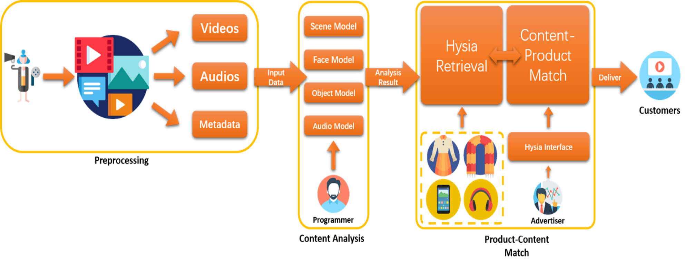
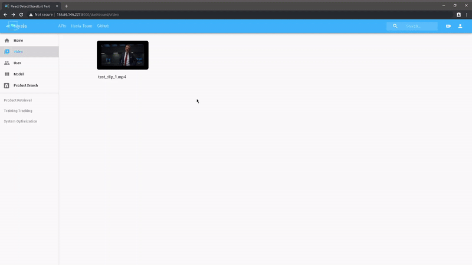
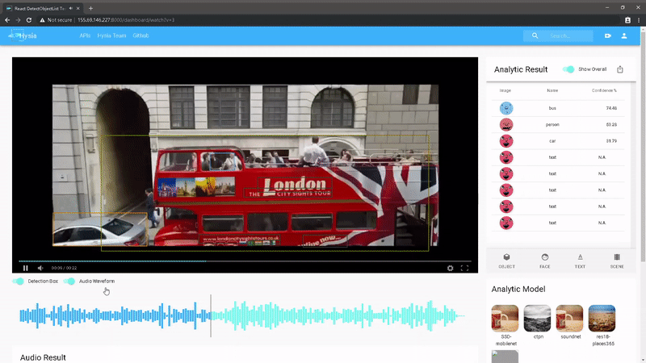
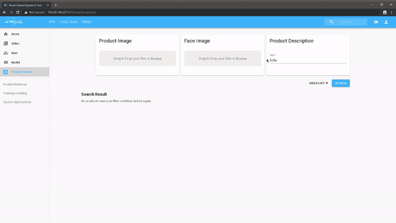
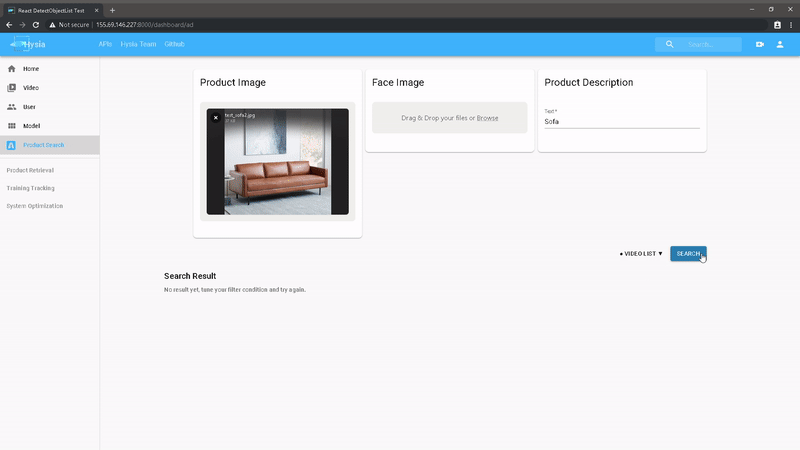
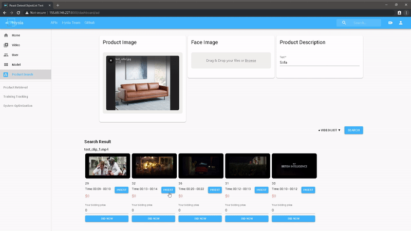
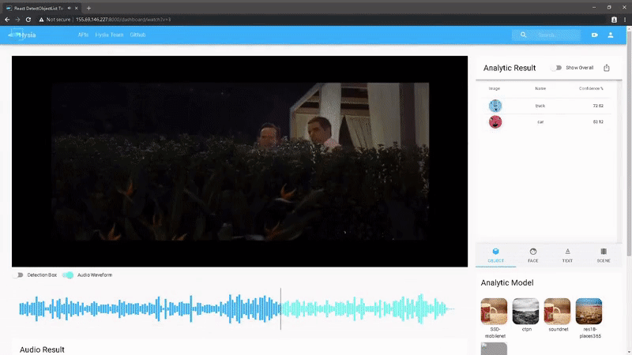

# Hysia Video to Online Platform \[V1.0\]
<sub>* This project is supported by 
[Cloud Application and Platform Lab](https://wiki.withcap.org) 
led by [Prof. Yonggang Wen](https://www.ntu.edu.sg/home/ygwen/)</sub>  

An intelligent multimodal-learning based system for video, product and ads analysis. You can build various downstream 
applications with the system, such as product recommendation, video retrieval. Several examples are provided.

**V2** is under active development currently. You are welcome to create a issue, pull request here. We will credit them
into V2.



## Table of Contents

1. [Highlights](#highlights)
2. [Showcase](#showcase)
3. [Download Data](#download-data)
4. [Installation](#installation)
5. [Configuration](#configuration)
6. [Demo](#demo)
7. [Some Useful Tools](#some-useful-tools)
8. [Todo List](#todo-list)
9. [Credits](#credits)
10. [Contribute to Hysia-V2O](#contribute-to-hysia-v2o)
11. [About Us](#about-us)

## Highlights
- Multimodal learning-based video analysis:
    - Scene / Object / Face detection and recognition
    - Multimodality data preprocessing
    - Results align and store
- Downstream applications:
    - Intelligent ads insertion
    - Content-product match
- Visualized testbed
    - Visualize multimodality results
    - Can be installed seperatelly


## Showcase

#### 1. Upload video and process it by selecting different models  


#### 2. Display video processing result  


    

    


#### 3. Search scene by image and text  


    


#### 4. Insert product advertisement and display insertion result    


    


## Download Data

Here is a summary of required data / packed libraries.

| File name     | Description | File ID | Unzipped directory  |
| ------------- | ----------- | ------- | ------------------- |
| [hysia-decoder-lib-linux-x86-64.tar.gz](https://drive.google.com/open?id=1fi-MSLLsJ4ALeoIP4ZjUQv9DODc1Ha6O) | Hysia Decoder dependent lib | 1fi-MSLLsJ4ALeoIP4ZjUQv9DODc1Ha6O | `hysia/core/HysiaDecode` |
| [weights.tar.gz](https://drive.google.com/file/d/1O1-QT8HJRL1hHfkRqprIw24ahiEMkfrX/view?usp=sharing) | Pretrained model weights | 1O1-QT8HJRL1hHfkRqprIw24ahiEMkfrX | `.` |
| [object-detection-data.tar.gz](https://drive.google.com/file/d/1an7KGVer6WC3Xt2yUTATCznVyoSZSlJG/view?usp=sharing) | Object detection data | 1an7KGVer6WC3Xt2yUTATCznVyoSZSlJG | `third/object_detection` |

For users without Google Drive access, you can download from [Baidu Wangpan](https://pan.baidu.com/s/12ZsA__TSNPl0riQ6hSciFQ) and unzip files correspondingly. (See [Option 2](#option-2-step-by-step-download))

#### Option 1: Auto-download
```shell script
# Make sure this script is run from project root
bash scripts/download-data.sh
cd ..
```

#### Option 2: Step-by-step download

Note: `curl` can be used to **download from Google Drive directly** according to [amit-chahar's Gist](https://gist.github.com/amit-chahar/db49ce64f46367325293e4cce13d2424). File names and file IDs are available from the above table:
```shell script
fileid=<file id>
filename=<file name>
curl -c ./cookie -s -L "https://drive.google.com/uc?export=download&id=${fileid}" > /dev/null
curl -Lb ./cookie "https://drive.google.com/uc?export=download&confirm=`awk '/download/ {print $NF}' ./cookie`&id=${fileid}" -o ${filename}
rm cookie
```
Please `cd` to the specific folder (from the above table, column `Unzipped directory`) before execute `curl`.

1\. Download [Hysia Decoder dependent libraries](https://drive.google.com/open?id=1fi-MSLLsJ4ALeoIP4ZjUQv9DODc1Ha6O) and unzip it:
```shell script
deocder_path=hysia/core/HysiaDecode
mv hysia-decoder-lib-linux-x86-64.tar.gz "${deocder_path}"
cd "${deocder_path}"
tar xvzf hysia-decoder-lib-linux-x86-64.tar.gz
rm -f hysia-decoder-lib-linux-x86-64.tar.gz
cd -
```

2\. Download pretrained [model weights](https://drive.google.com/file/d/1O1-QT8HJRL1hHfkRqprIw24ahiEMkfrX/view?usp=sharing)
and unzip it:
```shell script
tar xvzf weights.tar.gz
# and remove the weights zip
rm -f weights.tar.gz
```

3\. Download [object detection data](https://drive.google.com/file/d/1an7KGVer6WC3Xt2yUTATCznVyoSZSlJG/view?usp=sharing)
in third-party library and unzip it:
```shell script
mv object-detection-data.tar.gz third/object_detection
cd third/object_detection
tar xvzf object-detction-data.tar.gz
rm object-detection-data.tar.gz
cd -
```

## Installation

Requirements:
- Conda
- Nvidia driver
- CUDA = 9[*](#todo-list)
- CUDNN
- g++
- zlib1g-dev

We recommend to install this V2O platform in a UNIX like system. These scripts are tested on Ubuntu 16.04 x86-64 with 
CUDA9.0 and CUDNN7.  

#### Option 1: Auto-installation
Run the following script:
```shell script
# Execute this script at project root
bash ./scripts/install-build.sh
cd ..
```

#### Option 2: Docker  
See [Run with Docker](docker/README.md) to build and install. 

#### Option 3. Step-by-step installation 
```shell script
# Firstly, make sure that your Conda is setup correctly and have CUDA,
# CUDNN installed on your system.

# Install Conda virtual environment
conda env create -f environment.yml

conda activate Hysia

export BASE_DIR=${PWD}

# Compile HysiaDecoder
cd "${BASE_DIR}"/hysia/core/HysiaDecode
make clean
# If nvidia driver is higher than 396, set NV_VERSION=<your nvidia major version>
make NV_VERSION=<your nvidia driver major version>

# Build mmdetect
# ROI align op
cd "${BASE_DIR}"/third/
cd mmdet/ops/roi_align
rm -rf build
python setup.py build_ext --inplace

# ROI pool op
cd ../roi_pool
rm -rf build
python setup.py build_ext --inplace

# NMS op
cd ../nms
make clean
make PYTHON=python

# Initialize Django
# This will prompt some input from you
cd "${BASE_DIR}"/server
python manage.py makemigrations restapi
python manage.py migrate
python manage.py loaddata dlmodels.json
python manage.py createsuperuser

python -m grpc_tools.protoc -I . --python_out=. --grpc_python_out=. protos/api2msl.proto

unset BASE_DIR
```

#### * Optional: Rebuild the frontend  
You can omit this part as we have provided a pre-built frontend. If the frontend is updated, please run the following:  

Option 1: auto-rebuild
```shell script
cd server/react-build
bash ./build.sh
```

Option 2: Step-by-step rebuild  
```shell script
cd server/react-front

# Install dependencies
npm i
npm audit fix

# Build static files
npm run-script build

# fix js path
python fix_js_path.py build

# create a copy of build static files
mkdir -p tmp
cp -r build/* tmp/

# move static folder to static common
mv tmp/*html ../templates/
mv tmp/* ../static/
cp -rfl ../static/static/* ../static/
rm -r ../static/static/

# clear temp
rm -r tmp
```

## Configuration

- Decode hardware:  
    Change the configuration [here](server/HysiaREST/settings.py) at last line:  
    ```python
    DECODING_HARDWARE = 'CPU'
    ```
    Value can be `CPU` or `GPU:<number>` (e.g. `GPU:0`)
- ML model running hardware:
    Change the configuration of model servers under this [directory](server/model_server):
    ```python
    # Custom request servicer
    class Api2MslServicer(api2msl_pb2_grpc.Api2MslServicer):
        def __init__(self):
            ...
            os.environ['CUDA_VISIBLE_DEVICES'] = '0'
    ```
    A possible value can be your device ID `0`, `0,1`, ...

## Demo
```shell script
cd server

# Start model server
python start_model_servers.py

# Run Django
python manage.py runserver 0.0.0.0:8000
```

Then you can go to http://localhost:8000. Use username: admin and password: admin to login.

## Some Useful Tools

- Large dataset preprocessing
- Video/audio decoding
- Model profiling
- Multimodality data testbed

## Todo List

- [ ] Improve models
- [ ] Improve documents
- [ ] CUDA 10 support
- [x] Docker support
- [ ] Frontend separation
- [ ] A minimal product database 

## Credits

Here is a list of models that we used in Hysia-V2O. 

| Models        | GitHub Repo           | License  |
| ------------- |:-------------:| -----:|
| MMDetection      |  | |
| Google Object detection  |  |  |
| Scene Recognition | | |
| Audio Recognition | | |
| Image Retrieval | | |
| Face Detection | | |
| Face Recognition | | |
| Text Detection| | |
| Text Recognition| | |

## Contribute to Hysia-V2O

You are welcome to pull request. We will credit it in our version 2.0.

## About Us

### Maintainers
- Huaizheng Zhang [[GitHub]](https://github.com/HuaizhengZhang)
- Yuanming Li yli056@e.ntu.edu.sg [[GitHub]](https://github.com/YuanmingLeee)
- Qiming Ai [[GitHub]](https://github.com/QimingAi)
- Shengsheng Zhou [[GitHub]](https://github.com/ZhouShengsheng)

### Previous Contributors
- Wenbo Jiang (Now, Shopee) [[GitHub]](https://github.com/Lancerchiang)
- Ziyuan Liu (Now, Tencent) [[GitHub]](https://github.com/ProgrammerYuan)
- Yongjie Wang (Now, NTU PhD) [[GitHub]](https://github.com/iversonicter)
