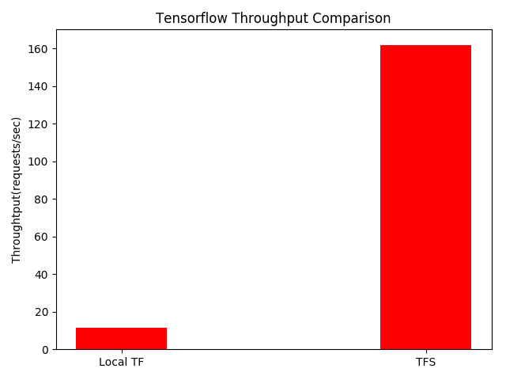

# Test Files Usage
## transform_pb_to_server_model.py
This file is initially intended to provide utility functions to transform from currently used model format(.pb) to TFS usable model file structure(showing below, folders marked in **bold**). 
- **Your-Model-Name**
  - **Your-Model-Version-Number**
    - saved_models.pb
    - **variables**
      - variables.data-00000-of-00001
      - variables.index

However, experiments prove that frozen models can not be used to generate TFS model files. To be specific, due to the fact that all variables in frozen graph are frozen, they are not technically variables anymore which leads to a empty variables folder.

Currently, you should use *save_server_models(sess, input, output)* function only. 

For the parameters:
  - sess: self explaining
  - input: input tensor
  - output: output tensor
```python
def save_server_models(sess, input, output):
    export_path_base = FLAGS.work_dir
    export_path = os.path.join(
        tf.compat.as_bytes(export_path_base),
        tf.compat.as_bytes(str(FLAGS.model_version)))
    print('Exporting trained model to', export_path)
    builder = tf.saved_model.builder.SavedModelBuilder(export_path)

    tensor_info_x = tf.saved_model.utils.build_tensor_info(input)
    tensor_info_y = tf.saved_model.utils.build_tensor_info(output)

    prediction_signature = (
        tf.saved_model.signature_def_utils.build_signature_def(
            inputs={'input': tensor_info_x},
            outputs={'output': tensor_info_y},
            method_name=tf.saved_model.signature_constants.PREDICT_METHOD_NAME))

    legacy_init_op = tf.group(tf.tables_initializer(), name='legacy_init_op')

    builder.add_meta_graph_and_variables(
        sess, [tf.saved_model.tag_constants.SERVING],
        signature_def_map={
            'prediction':
                prediction_signature,
        },
        legacy_init_op=legacy_init_op)

    builder.save()

    print('Done exporting!')
```

## test_tfs_throughtput.py
This script is a implementation of testing vgg on TFS using docker. So please run your docker server before you run this script. Here 's a command example of how you start the docker server:
```bash
docker run --runtime=nvidia -p 8500:8500 -p 8501:8501\
  --mount type=bind,\
  source=/path/to/your/vggish/model,\
  target=/models/vggish \
  -e MODEL_NAME=vggish -t tensorflow/serving:latest-gpu &
```
One **important** thing to be noticed: by using *'-p port_a:port_b'* option, you bind port_a in docker to your local port_b. Defined by TFS, port 8500 is reserved for grpc, port 8501 is reserved for RESTFul API. In the code, we use grpc to communicate with server. Hence, make sure you publish grpc port. Then you can run this script.

## Thoughput Comparison
GPU: Tesla K40  
Test Model: Audioset VGG  
Test Times: 100  
Local TF: 11.4578  
TFS: 161.9980  

