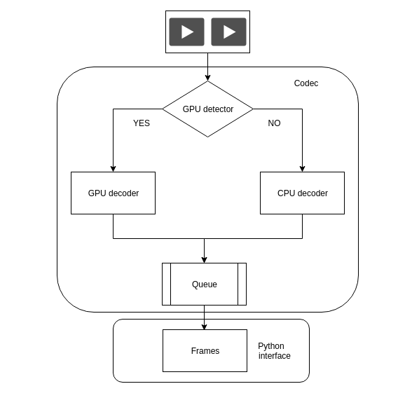

# HysiaDecode

This repository aims to provide a highly efficient and user-friendly video pre-processing library. 

The whole pipeline of the HysiaDecode can be illustrated in the following diagram. The Decode module firstly detect the GPU exist. If GPU exists, the module will select the GPU decoding function priory. Otherwise, the module will select the CPU decoding function. It depends on user‘s hardware configuration.So    it support various types of users. After decoding, we save the data into a queue, and the applications can fetch the frames from the queue. To facilitate Python users,  we  warp the C++ function to Python using `Pybind11`.  You can follow the example you provided in test directory.  Enjoy your experience and don't forget to report the issue you encountered! 



| DIR       | Description                                     |
|:----------|:------------------------------------------------|
| `include` | header files(include the dependencies)          |
| `lib`     | required libraries(E.g., OpenCV, FFmpeg, Cuvid) |
| `src`     | implementation of decoding function             |
| `python`  | warp the C++ function to Python                 |
| `test`    | test files                                      |
| `build`   | save the generated files(.o and .so) after make |
| `utils`   | some pre-implemented functions in NvDecode      |

# Required Packages and Platform

| Requirement | Minimal Version                     |
|:-----------:|:-----------------------------------:|
| Platform    | Ubuntu 16.04, Manjaro 17.10 etc.    |
| Nvidia GPU  | Titan X, M6000 etc.                 |
| NV Driver   | Major version 396 or later          |
| CUDA        | CUDA 8.0 or later                   |


# Installation

## Install Dependencies

For ubuntu user, you can install NVIDIA driver under this instruction belowing:
```shell script
sudo apt-get purge nvidia*
sudo add-apt-repository ppa:graphics-drivers 
sudo apt-get update
sudo apt-get install nvidia-396 
lsmod | grep nvidia 
```

Pybind11 is also necessary, because we use Pybind wrap the C++ function to Python

```shell script
pip install pybind11
```

## Build

Create `build` directory
```shell script
mkdir -p build
```

If the required hardware or driver is not available
```shell script
make CPU_ONLY=TRUE
```
Otherwise
```shell script
make
```

After compilation and link, a dynamic lib `PyDecoder.cpython-3xm-x86_64-linux-gnu.so` will be generated in the build directory. 

## Verify

To check if there is some missing in library:
```shell script
ldd build/PyDecoder.cpython-3xm-x86_84-linux_gnu.so | grep 'not'
``` 
If there is some library not found, install the missing library and [rebuild](#build) again.   

To test in python, add the build dir (i.e. 
`{PROJECT_ROOT}/src/HysiaDeocde/build`) and run test: 

```shell script
export PYTHONPATH="${PYTHONPATH}":{PROJECT_ROOT}/src/HysiaDeocde/build
python test/test_decoder.py
```

Or you may call the backend APIs by import the decoder directly:
```python
import PyDecoder
```

## List of common missing libraries

| Missing `.so`   | Cause | Package to install* |
|:------------------------|:-----:|:--------------------|
| `libcuda.so`    | CUDA  | [CUDA install guide] | N.A.
| `libcudart.so`  | CUDA  | See above |
| `libcuvid.so`   | CUDA  | See above |
|  `libvpx.so`    | Video codec lib | `libvpx3` ![16.04][16.04] <br /> `libvpx5` ![18.04][18.04] ![19.04][19.04] <br /> `libvpx6` ![19.10][19.10] |
| `libfdk-aac.so` | Fraunhofer FDK AAC | `libfdk-acc0` ![16.04][16.04] <br /> `libfdk-acc1` ![18.04][18.04] ![19.04][19.04] ![19.10] |
| `libx265.so`    | x265 HEVC Encoder | `libx265-79` ![16.04][16.04] <br /> `libx265-146` ![18.04][18.04] <br /> `libx265-176` ![19.04][19.04] <br /> `libx265-179` ![19.10][19.10] |
| `libva.so`      | Video Acceleration API | `libva1` ![16.04][16.04] <br /> `libva2` ![18.04][18.04] ![19.04][19.04] ![19.10][19.10] |
| `libva-drm.so`  | Video Acceleration API | `libva-drm1` ![16.04][16.04] <br /> `libva-drm2` ![18.04][18.04] ![19.04][19.04] ![19.10][19.10] |
| `libva-x11.so`  | Video Acceleration API | `libva-x11-1` ![16.04][16.04] <br /> `libva-x11-2` ![18.04][18.04] ![19.04][19.04] ![19.10][19.10] |
| `libopenblas.so` | OpenBLAS | `libopenblas-base` ![16.04][16.04] ![18.04][18.04] ![19.04][19.04] ![19.10][19.10] |

\* For Ubuntu only. Use the command `sudo apt-get install {PACKAGE-NAME}` to install.
Try [package search](https://packages.ubuntu.com/search) if your machine version is not listed.    
If your linux is other distribution, please install the suitable dynamic libraries.

![16.04][16.04] Ubuntu 16.04 LTS ![18.04][18.04] Ubuntu 18.04 LTS ![19.04][19.04] Ubuntu 19.04 ![19.10][19.10] Ubuntu 19.10

# Performance 

we test the decoding speed on our server(Titan X, Intel(R) Xeon(R) CPU E5-2630 v3 @ 2.40GHz) using several video clips from The Big Bang Series.  We also compare the decoding speed with released algorithms in OpenCV.  We achieved the considerable performance. Need to notice, our library provide Python interface which can be easily used for users who don't familiar with C/C++.  This is only a alpha version of decoding. In the next step, we will continue optimizing the library to achieve a large throughput.  You are also welcomed to join our team to contribute your code. We also found that GPU initialization takes up much time. If you want to decode a short video clip, we recommend using CPU. Otherwise, GPU is preferred.

Hardware | Speed
---|---
GPU decoding(Titan X) | ~800 frames/s
CPU (Intel E5-2630) | ~200 frames/s 
Python  cv2.VideoCapture | 375 frames /s 
OpenCV VideoCaptur* | 399 frames /s 
OpenCV  cv::cudacodec::VideoReader* | 865 frames/s 

\[1] Intel<sup>Ⓡ</sup> Core™ i9-9940X  
\[2] NVIDIA<sup>Ⓡ</sup> TITAN Xp  
\[3] NVIDIA<sup>Ⓡ</sup> GeForce RTX 2080 Ti  

† Run with OpenCV Python API `cv2`.  
\* Run with OpenCV C++ API `cv`.  
× Run with OpenCV CUDA-accelerated C++ API `cv:cudacodec`.

#  Issues

Some issues we met in develop and test. If you meet the same error, you can refer the  solution we provide here.

- issue 1

```
GPU in use: Quadro M6000
Traceback (most recent call last):
  File "test_gpu_decoder.py", line 19, in <module>
    dec.ingestVideo(video_path)
RuntimeError: NvDecoder : cuvidCtxLockCreate(&m_ctxLock, cuContext) returned error -1282253296 at src/NvDecoder/NvDecoder.cpp:524
```
 Solution : This error comes from cuvid link conflicts. You should link 

- Issue 2

```
the decoding processing is blocked and does not start the decoded process
```

Solution: When it happens, maybe your GPU does support NVDecode. You should try to consult the Nvidia documents to check whether you graphical card are suitable. In this repository, we detached the decoded function from Video_Codec_SDK_8.2.16. 


# Reference

We referred the released repositories listed below:

[Nvidia video_codec_SDK_8.2.16]  
[scanner video decoding]  
[Nvidia NVVL]  
[FFmpeg official tutorials]

[CUDA install guide]: https://docs.nvidia.com/cuda/cuda-installation-guide-linux/index.htm
[16.04]: https://via.placeholder.com/20/EA5922.webp/fff?text=16.04
[18.04]: https://via.placeholder.com/20/8D3770.webp/fff?text=18.04
[19.04]: https://via.placeholder.com/20/2C6888.webp/fff?text=19.04
[19.10]: https://via.placeholder.com/20/45D490.webp/000?text=19.10
[Nvidia video_codec_SDK_8.2.16]: https://developer.nvidia.com/nvidia-video-codec-sdk
[scanner video decoding]: https://github.com/scanner-research/scanner/tree/master/scanner/video/nvidia
[Nvidia NVVL]: https://github.com/NVIDIA/nvvl
[FFmpeg official tutorials]: https://ffmpeg.org/doxygen/trunk/encoding-example_8c-source.html#l00325